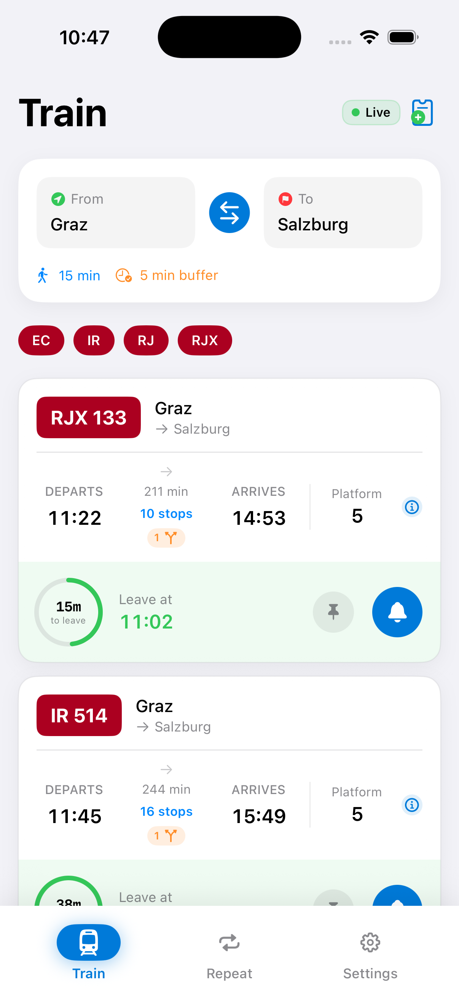
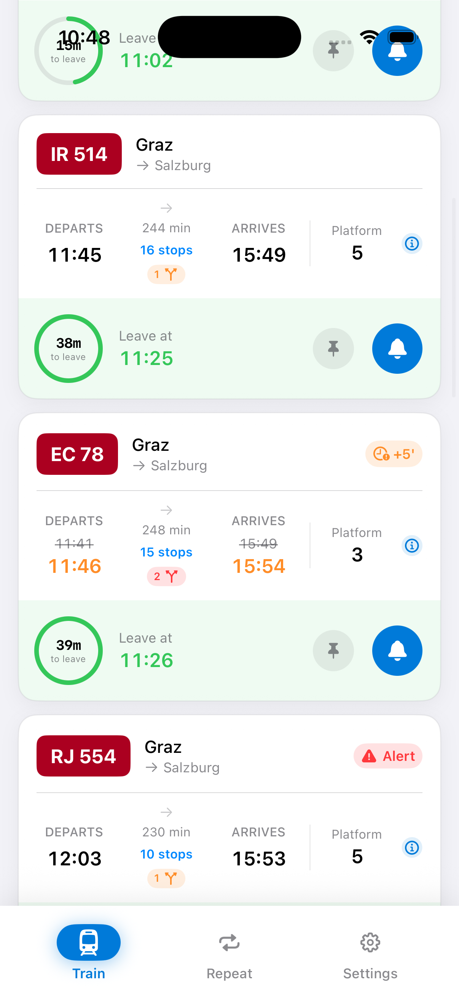
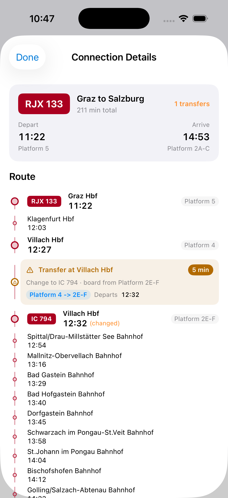
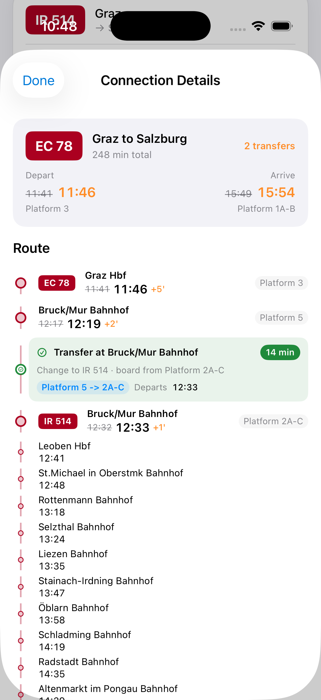
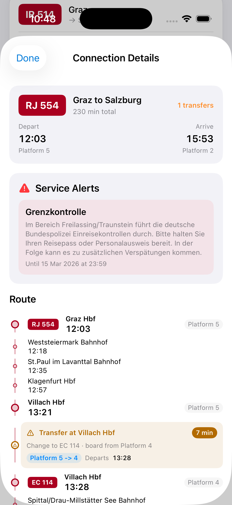
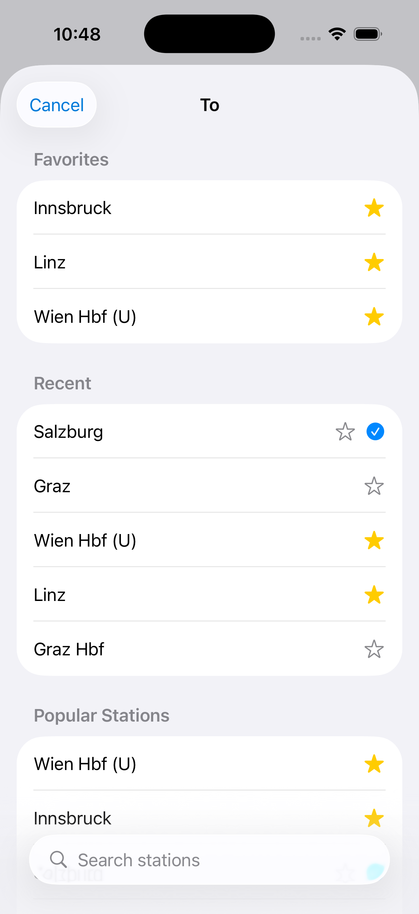
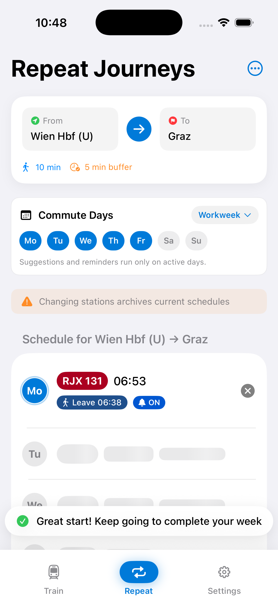
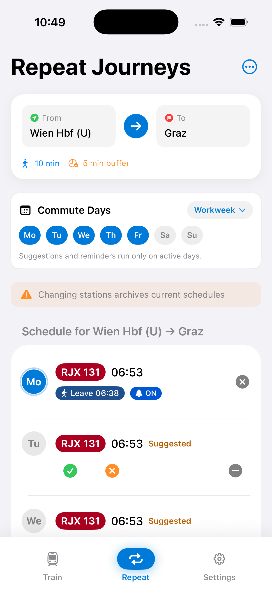
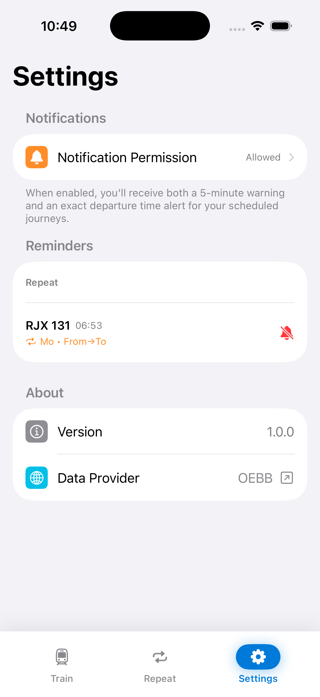

# Gleis

Gleis is an iOS commute app.
It helps you answer one question fast:
**When do I need to leave to catch my train?**

It combines route data, transfer timing, delays, and your own walking/buffer time.
Then it shows a clear leave-time on each connection card.

## What You Get

- Live train connections for your selected route
- Clear leave-time guidance per connection
- Pinnable journeys for quick daily access
- Repeat commute schedules for weekdays
- Home screen widget support
- Reminder notifications and service alerts

## Screenshots

<table>
  <tr>
    <td align="center">
      <br />
      <sub>Train overview</sub>
    </td>
    <td align="center">
      <br />
      <sub>More connections</sub>
    </td>
    <td align="center">
      <br />
      <sub>Connection details</sub>
    </td>
  </tr>
  <tr>
    <td align="center">
      <br />
      <sub>Delay + transfer risk</sub>
    </td>
    <td align="center">
      <br />
      <sub>Service alerts</sub>
    </td>
    <td align="center">
      <br />
      <sub>Station picker</sub>
    </td>
  </tr>
  <tr>
    <td align="center">
      <br />
      <sub>Repeat setup</sub>
    </td>
    <td align="center">
      <br />
      <sub>Repeat suggestions</sub>
    </td>
    <td align="center">
      <br />
      <sub>Settings</sub>
    </td>
  </tr>
</table>

## Requirements

- macOS with a recent Xcode version (iOS 17 simulator support)
- Xcode project build target: iOS 17.0+
- Internet connection for live train data

No extra package install is needed.
There are no third-party dependency managers in this repo.

## Run Locally

1. Clone the repo:
   ```bash
   git clone https://github.com/VenoGaube/Gleis.git
   cd Gleis
   ```
2. Open the project:
   ```bash
   open Gleis.xcodeproj
   ```
3. In Xcode, choose scheme `Gleis`.
4. Select an iOS 17+ simulator.
5. Press Run (`Cmd + R`).

## Run On A Real iPhone (Optional)

1. Set your Apple Development Team for `Gleis` and `GleisWidgetExtension`.
2. Use unique bundle identifiers for both targets.
3. Ensure App Group capability matches in both targets.
4. Build and run on your connected device.

If you only use the simulator, you can skip most signing setup.

## How To Use

1. Open the app and pick your `From` and `To` stations.
2. Set walking time and buffer time for better leave-time accuracy.
3. In the Train tab, choose a connection and tap the bell to schedule reminders.
4. Pin a journey if you want one commute always visible at the top.
5. In Repeat, set your weekday schedules for regular trips.
6. In Settings, confirm notification permission is enabled.

## Permissions Used

- Notifications: for leave-time reminders
- Camera (optional): for ticket card scanning

## Legal Notes

- Gleis is an independent project.
- It is not affiliated with or endorsed by OEBB.
- Transport data usage must follow provider terms and licensing.

## License

MIT. See [LICENSE](LICENSE).
